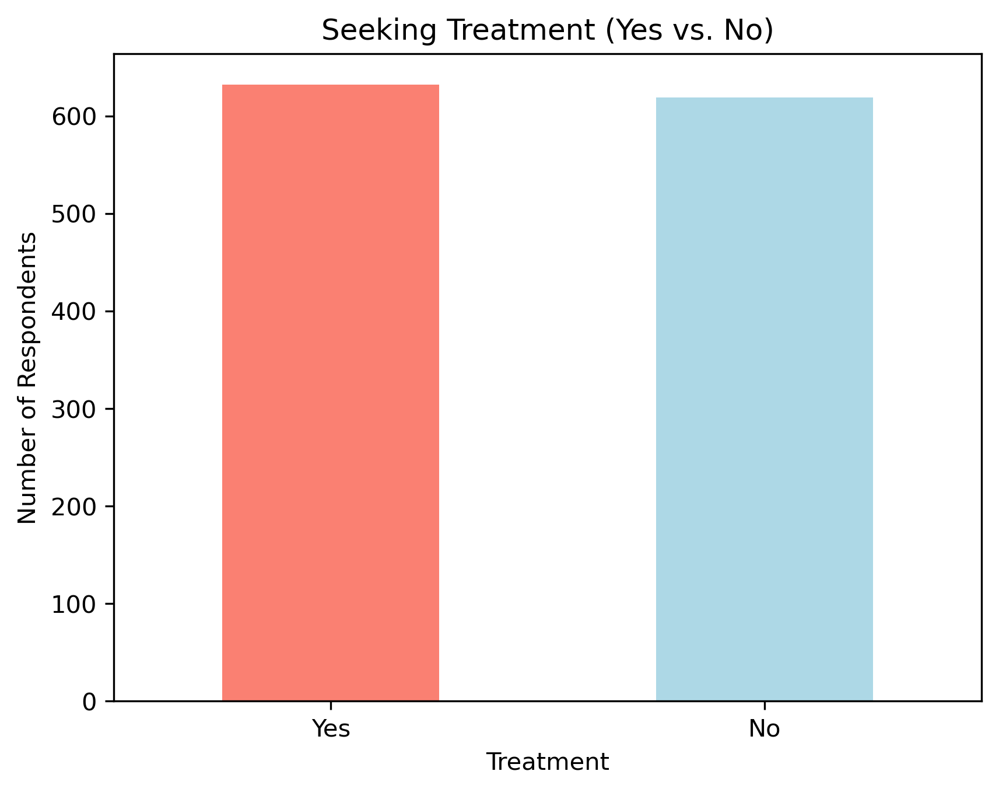
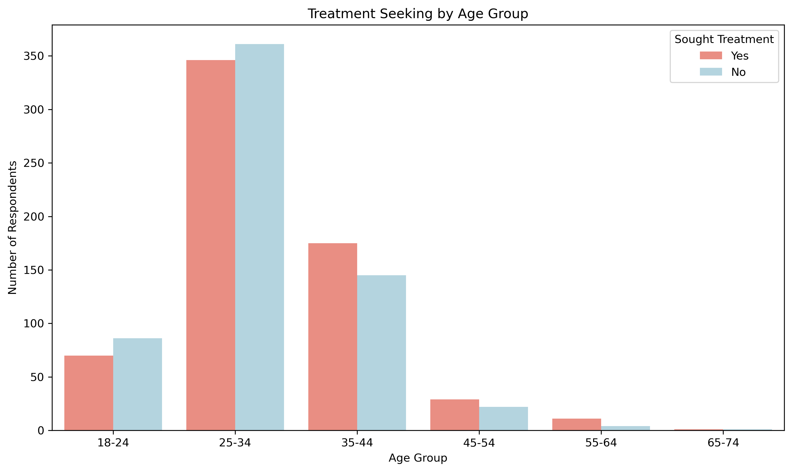
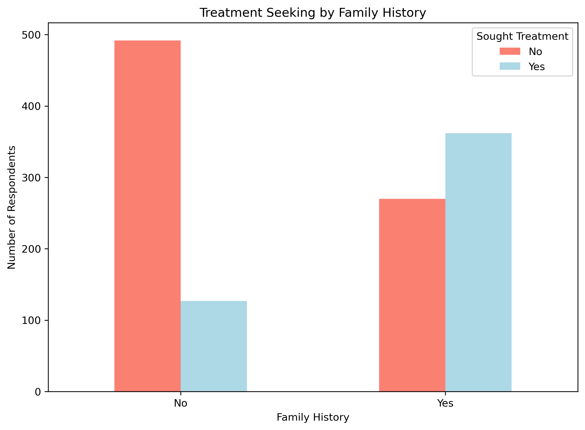
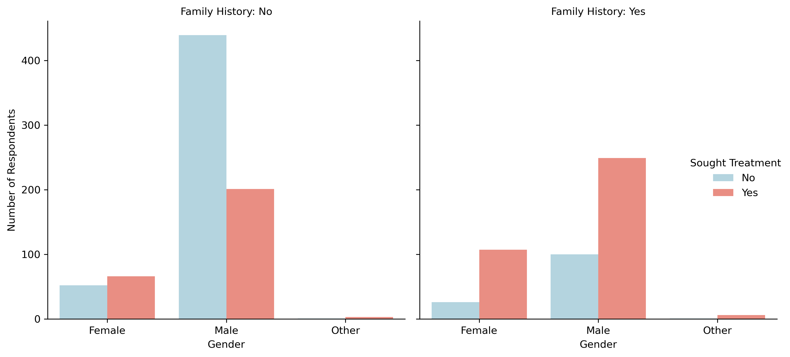
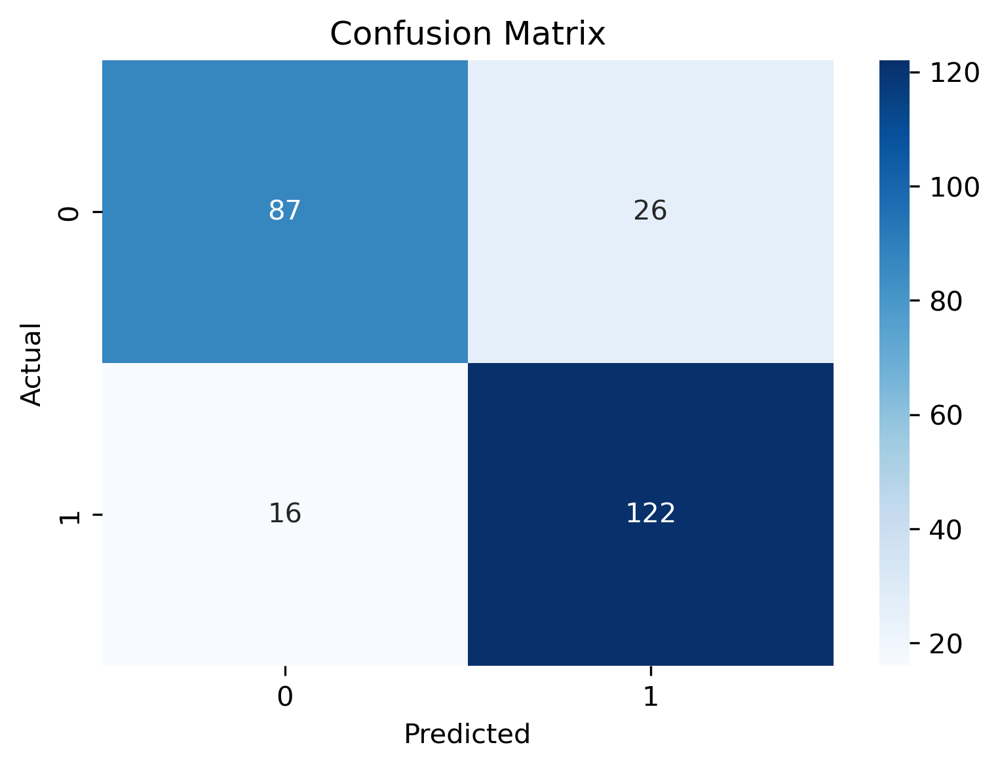
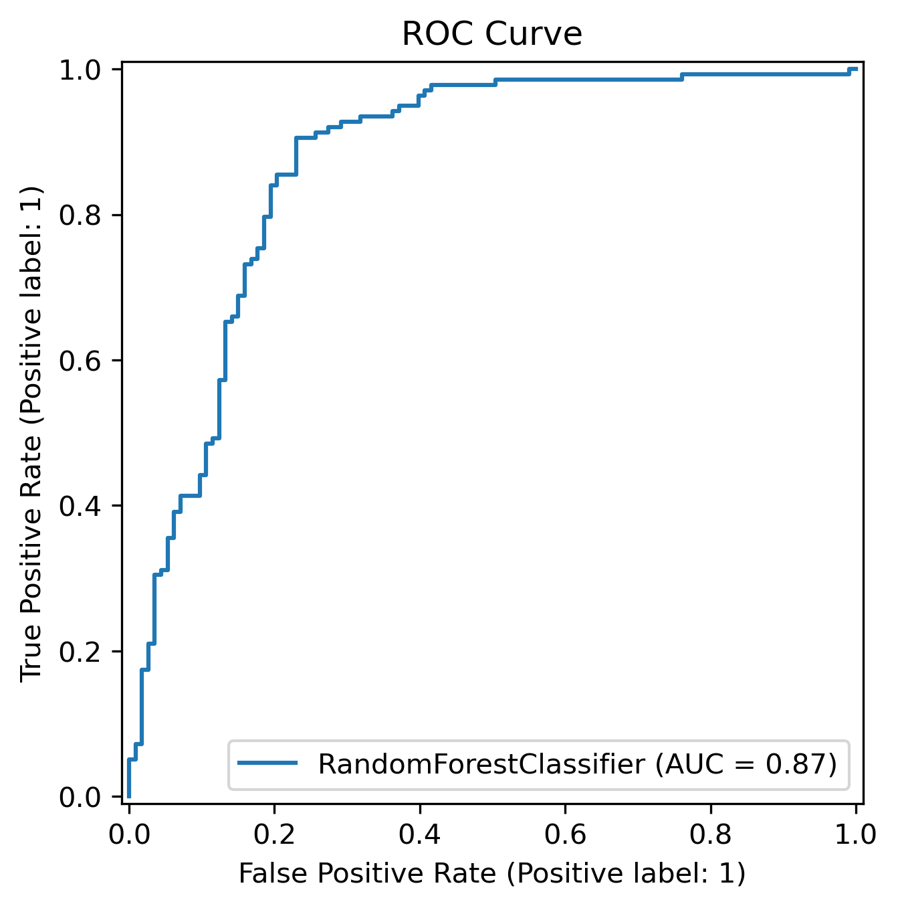
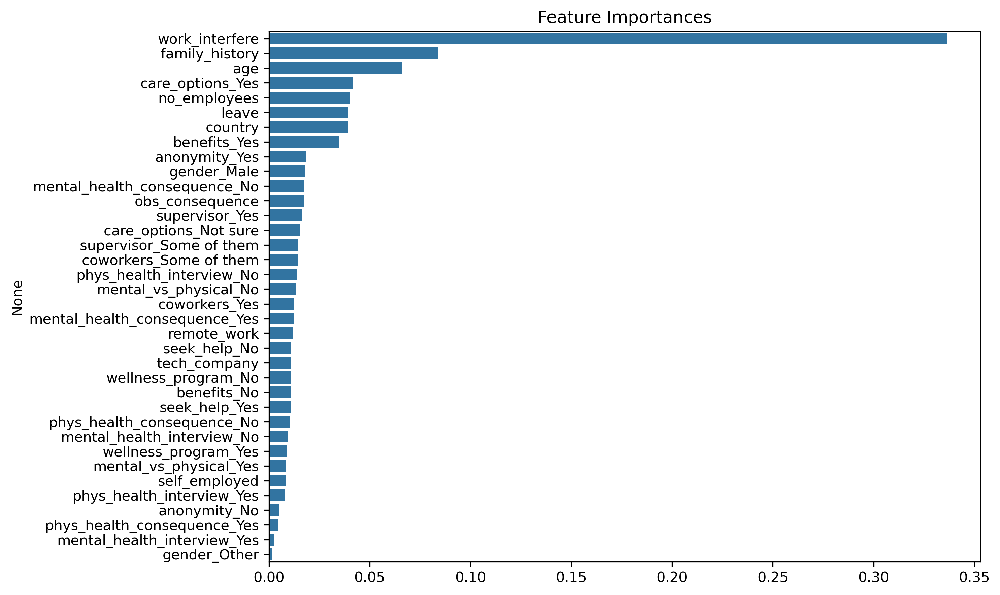

# 🧠 Mental Health in Tech Industry - ML Prediction Project

This project applies machine learning to predict whether an individual in the tech industry is likely to seek treatment for mental health. The dataset used comes from the [Mental Health in Tech Survey](https://www.kaggle.com/datasets/osmi/mental-health-in-tech-survey), and this repository demonstrates the full pipeline from preprocessing to evaluation and reporting.

## 📌 Project Objectives

- Clean and preprocess mental health survey data
- Explore and visualize relationships between variables
- Train and evaluate classification models
- Tune hyperparameters for optimal performance
- Deploy-ready feature processing and pipeline
- Generate professional evaluation metrics and charts

## 📊 Exploratory Data Analysis (EDA)

📌 1. Distribution of the Target

- Variable: treatment
- Explored how many respondents sought treatment vs. did not.

Insights:
- There is a fairly balanced distribution between respondents who sought treatment and those who didn’t.
- Indicates potential for meaningful classification without heavy imbalance correction.

 

📌 2. Distribution of Age
- Summary statistics: mean, median, min, max
- Outliers filtered: kept only ages between 18 and 75
- Created meaningful age groups: 18–24, 25–34, ..., 65–74, which may be useful for modeling.

Insights:
- Majority of respondents are between 25 and 44 years old.
- Very few respondents are over 65 or under 18.
- Revealed how age correlates with treatment-seeking behavior

 

📌 3. Gender Normalization
- Cleaned and grouped gender values (e.g., ‘F’, ‘female’, ‘Woman’ → Female)
- Normalization reduced noise and brought clarity to gender-based patterns.

Insights:
- Most responses came from Male and Female categories.
- Final categories: Male, Female, Other

📌 4. Treatment by Family History
- Compared family_history vs. treatment
- Those with family history appeared more likely to seek treatment

Insights:
- People with a family history of mental illness were more likely to seek treatment.
- Shows strong potential as a predictive feature.

 

📌 5. Multivariate Grouping
- Grouped by gender, family history, and treatment
- Created a meaningful breakdown of how these interact
- Females with a family history had the highest treatment-seeking rate.

Insights:
- More females may be likely to seek treatment than males
  1. Females with family history:
  - 107 / (107 + 26) = 80.5% sought treatment
  2. Males with family history:
  - 249 / (249 + 100) = 71.3% sought treatment
  3. Other with family history:
  - 6 / (6 + 1) = 85.7% sought treatment
- Males without family history were the least likely to seek treatment.
- Suggests important interactions between features like gender and family history.

 

## 🧪 Modeling & Evaluation

1. Without tuning

- Logistic Regression: 0.7689243027888446
- Random Forest Classifier: 0.796812749003984
- Gradient Boosting Classifier: 0.7848605577689243

2. Hyperparameter Tuning (By hand)

- Logistic Regression: 0.8207171314741036
- Random Forest Classifier: 0.8326693227091634
- Gradient Boosting Classifier: 0.8286852589641435

3. Hyperparameter Tuning (By RandomizedSeacrhCV)

- Random Forest Classifier: 0.8247011952191236
- Gradient Boosting Classifier: 0.8207171314741036

4. Hyperparameter Tuning (By GridSeacrhCV)

- Random Forest Classifier: 0.7928286852589641

📌 Best model: Random Forest (after tuning by hand)
- Best params: {'n_estimators': 50, 'max_depth': 10, 'min_samples_split': 2, 'max_features': 'sqrt'}
- Best accuracy: 0.8326693227091634

## 🔍 Metrics Evaluated

We used the following metrics to validate the model performance:

✅ Classification Report
✅ Cross-Validation: [0.835 0.835 0.86  0.775 0.825]
✅ Accuracy: 0.8327
✅ Precision: 0.8243, Recall: 0.8841, F1-Score: 0.8531
✅ ROC-AUC Score: 0.8696
✅ Confusion Matrix

 

 

## 🧬 Feature Importance

 

### Top 5 Key influencing features

- work_interfere
- family_history
- age
- care_option
- no_employees

## 🧰 Tech Stack

- Python (pandas, scikit-learn, matplotlib, seaborn)
- Jupyter Notebooks

> This project showcases my skills in data preprocessing, model selection, tuning, and evaluation, ready for real-world deployment
